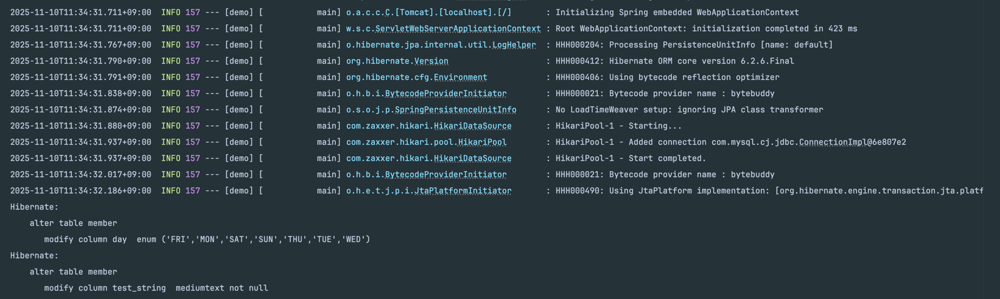
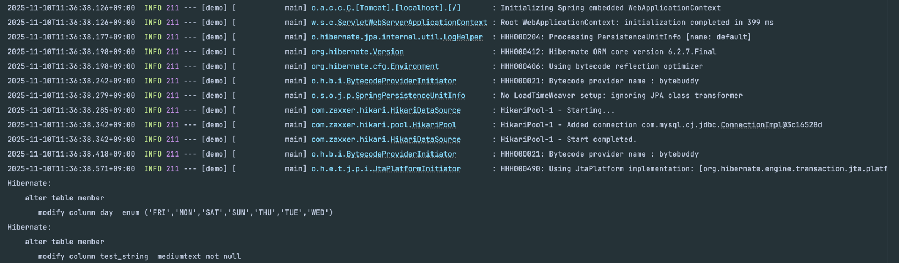
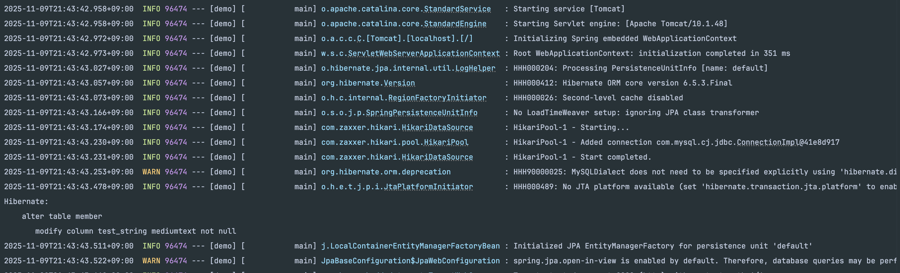
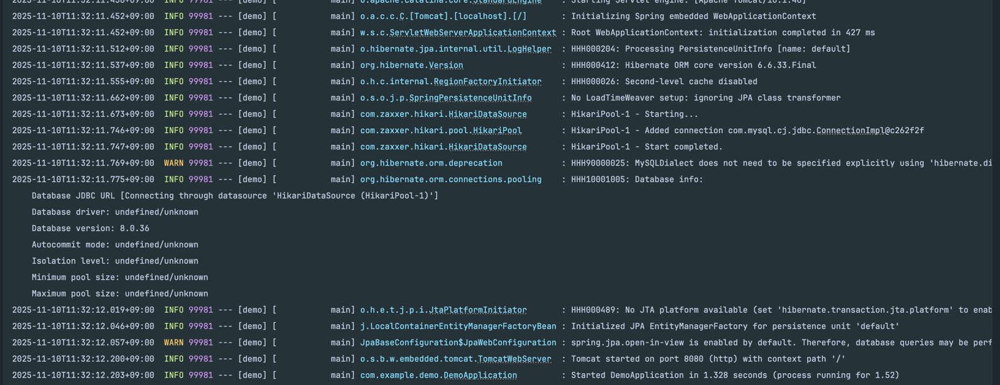

# Hibernate DDL-Auto Bug Reproduction (HHH-17062)

This is a minimal reproduction project for the unnecessary ALTER TABLE bug related to the spring.jpa.hibernate.ddl-auto: update option, as discussed in HHH-17062 (and related issues).

---

# Bug Summary

When using `spring.jpa.hibernate.ddl-auto=update`, Hibernate generates `ALTER TABLE` statements for `enum` and `mediumtext` columns on every application start, even when the entity model has not changed.

- Hibernate 6.2.7.Final: Bug occurs for both enum and mediumtext.
- Hibernate 6.5.3.Final: Bug occurs for mediumtext.
- Hibernate 6.6.33.Final: Bug is resolved.

---

# How to Reproduce

## 1. Prerequisites
- git clone this repository.
- Create an empty schema (database) named `hibernate_bug_demo` on your local MySQL server.
```mysql
CREATE DATABASE hibernate_bug_demo;
```
- **[!! IMPORTANT !!]** Open `src/main/resources/application.properties` and **update `spring.datasource` with your own local DB information**. 
  - This file is not in `.gitignore`, so please be careful not to commit sensitive information.

## 2. Test by Version

In the `build.gradle` file, uncomment the Hibernate version you wish to test within the ext block.

**Example: Testing 6.5.3.Final**
```
ext {
    // 'hibernate.version' = '6.2.7.Final'
    'hibernate.version' = '6.5.3.Final' // <-- Test this version
    // 'hibernate.version' = '6.6.33.Final'
}
```

## 3. Run the Application

Run the application from your terminal:
```shell
./gradlew bootRun
```

## 4. Confirm the Bug (Screenshot)


Check the console log when the application starts. If you selected `6.2.6.Final` in `build.gradle`,
you will see the unnecessary `ALTER TABLE ... modify column ... enum`, 
`ALTER TABLE ... modify column ... mediumtext` log printed to the console.



Check the console log when the application starts. If you selected `6.2.6.Final` in `build.gradle`,
you will see the unnecessary `ALTER TABLE ... modify column ... enum`,
`ALTER TABLE ... modify column ... mediumtext` log printed to the console.



Check the console log when the application starts. If you selected `6.5.3.Final` in `build.gradle`, 
you will see the unnecessary `ALTER TABLE ... modify column ... mediumtext` log printed to the console.



You can confirm that the same `ALTER TABLE` log is printed every time you restart the application (after terminating with `Ctrl+C`).
If you change the version to `6.6.33.Final` in `build.gradle` and re-run, this log will disappear.


